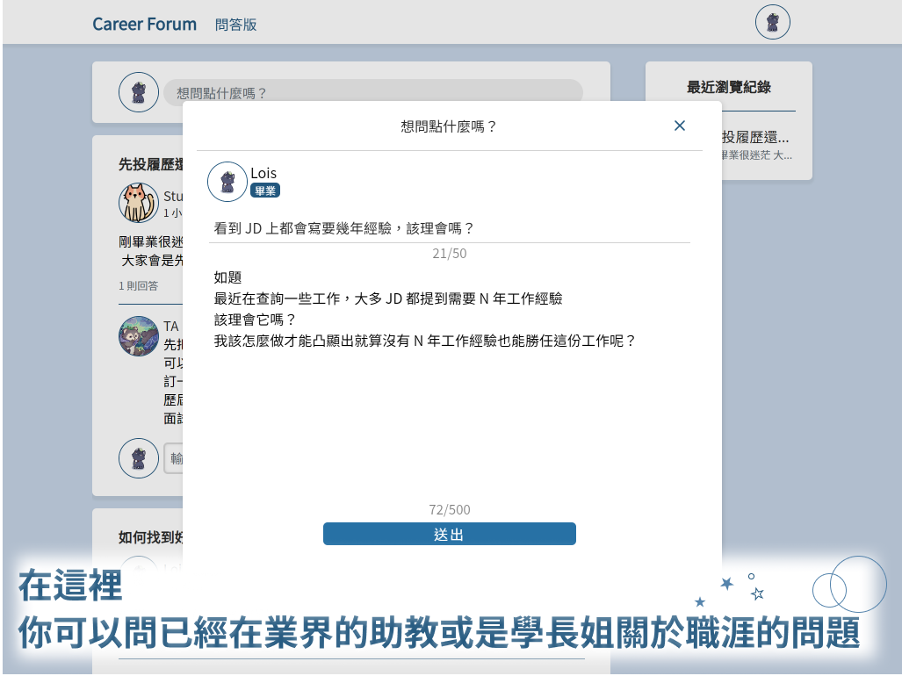
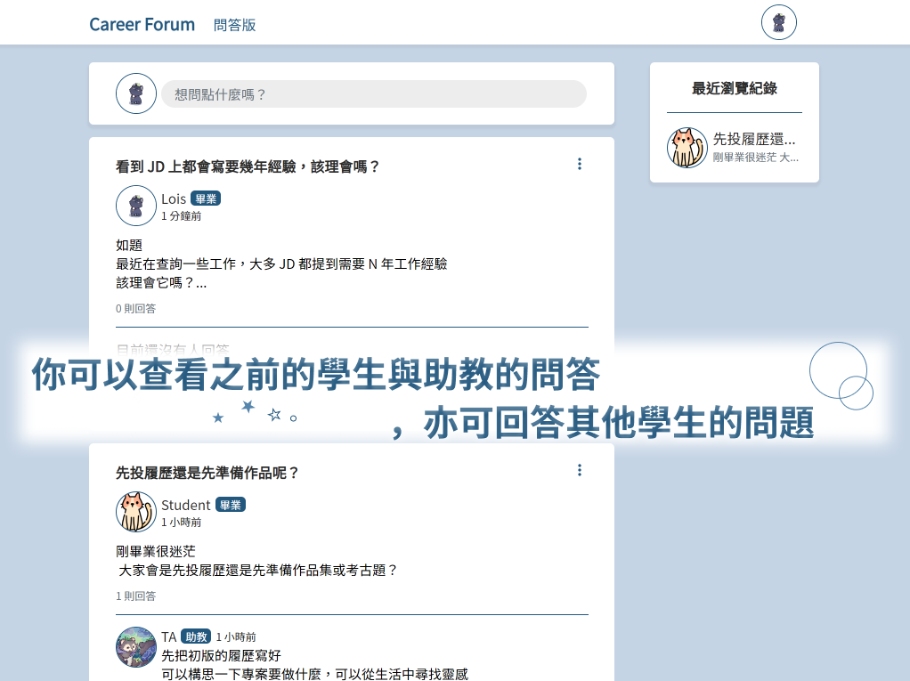

<div align="center">

<h1><b>職涯論壇 Career Forum</b></h1>
<h3>人生沒有明確的答案，<br/>
但你可以透過問答探尋你的職涯方向</h3>
<br/>
<h3><a href="https://careerforum-git-main-loischen68.vercel.app/careerforum" target="_blank">前往我們的職涯論壇</a></h3>
<table>
<label>範例帳號</label>
  <tr>
    <th>email</th>
    <td>user@careerForum.com</td>
  </tr>
  <tr>
    <th>password</th>
    <td>As123456!</td>
  </tr>
</table>
<br/>

</div>

## 目錄
- [預覽畫面](#預覽畫面)
- [關於 Career Forum](#關於-career-forum)
- [使用者故事](#使用者故事)
- [在本地運行伺服器](#在本地運行伺服器)
- [團隊成員](#開發團隊)

## 預覽畫面




## 關於 Career Forum
Career Forum 是一個由兩名學生發起的專案，目的是為了提供給 Alpha Camp 校友發問討論職涯相關的論壇，最後由兩名前端與兩名後端組成共同完成專案。

### 正式網站使用資格
  - Alpha Camp 助教
  - 所有學期三就讀中的 Alpha Camp 學生
  - 畢業於學期三的 Alpha Camp 學生

### 啟用計畫
- 初見階段（2023/2月初）：招募助教試用論壇，並針對回饋做調整。
- 第一階段（2023/2月中）：招募共 30 位使用者啟動論壇。
- 第二階段（2023/2月後持續）：收集使用者回饋並持續優化及維護。
- 第三階段（未定）：開放給所有學期三畢業之校友及助教使用。

## 我們使用的技術與開源工具包
[](https://skills.thijs.gg)

### 共同
- 使用 [Notion](https://www.notion.so/) 建立共同工作區管理工作及開發筆記。
- 使用 [Discord](https://discord.com/) 語音連線及文字頻道記錄各項討論。
- 使用 [Google Slides](https://www.google.com.tw/intl/zh-TW/slides/about/) 製作專案發想簡報。


### 前端
- 使用 [Figma](https://www.figma.com/) 初步建立設計稿。
- 使用 [typescript](https://github.com/microsoft/TypeScript) 進行編寫。
- 使用 [eslint](https://github.com/eslint/eslint) 與 [prettier](https://github.com/prettier/prettier) 統一程式碼品質。
- 使用 [Jest](https://github.com/facebook/jest) 與 [testing-library](https://github.com/testing-library/react-testing-library) 測試以保護程式碼品質。
- 使用 context 管理狀態。
- 使用 [check-password-strength](https://www.npmjs.com/package/check-password-strength) 建立密碼強度驗證。
- 使用 [dayjs](https://www.npmjs.com/package/dayjs) 顯示人性化時間。
- 使用 [react-infinite-scroll-component](https://github.com/ankeetmaini/react-infinite-scroll-component) 建立 lazy loading 以優化效能。
- 使用 [react-icons](https://react-icons.github.io/react-icons/) 在網站上顯示好看的圖標。
- 使用 [react-cookie](https://www.npmjs.com/package/react-cookie) 儲存用戶最近瀏覽紀錄。
- 使用 [sass](https://github.com/sass/sass) CSS 預處理器，使 CSS 代碼更加簡潔和重用性。
- 使用 [react-toastify](https://www.npmjs.com/package/react-toastify) 創建自定義和響應式彈出消息框。
- 使用 [vercel](https://vercel.com/) 部署網站。

### 後端
- [Backend API Server](https://github.com/AdrieneTZ/career-forum-backend)

## 使用者故事

### 前台
:white_check_mark: 可以註冊 / 登入，但限定是來自 Alpha Camp 的用戶。

:white_check_mark: 使用者可以發文到問題版上。

:white_check_mark: 使用者可以回答問題。

:white_check_mark: 使用者可以上傳大頭貼、設定個人資料。

:white_check_mark: 使用者可以編輯他的問題，編輯僅限本人。

:white_check_mark: 回答者可以編輯他的回答，編輯僅限本人。
### 即將推出
- [ ] 使用者可以透過忘記密碼收到修改密碼信。
- [ ] 使用者可以收藏問題，在問題得到回答時得到通知。
- [ ] 使用者可以追蹤其他用戶，並在用戶發問或回答時得到通知。
- [ ] 使用者可以在問問題時對問題設定分類：面試、職涯、履歷、offer、公司 相關。
- [ ] 使用者可以用關鍵字查詢是否有相關的問答及其他用戶。
- [ ] 使用者可以對問題或回答按讚、倒讚、表情。
- [ ] 使用者可以在個人資料頁看到歷史問答得到多少讚，以及總讚數。
- [ ] 使用者可以在個人資料頁看到歷史問答及概覽，也可以點進去查看。
- [ ] 問題擁有者可以選擇最佳解答。
- [ ] 使用者可以對回答進行排序：讚數、日期，預設的排序為得讚數最多。
- [ ] 使用者可以對首頁的問題進行排序：讚數、日期，預設排序為最新。
- [ ] 使用者可以透過首頁的問題分類查看對應類別的問題。

### 後台
:white_check_mark: 管理者可更改使用者審核狀態
- [ ] 管理者可更改使用者身分
- [ ] 管理者可刪除問題與回答

## 在本地運行伺服器
### 後端

git clone 後端 server 伺服器

步驟參照：[Backend API Server](https://github.com/AdrieneTZ/career-forum-backend)

### 前端
1. git clone 專案
```
git clone https://github.com/LoisChen68/careerforum.git
```
2. npm 安裝
```
npm i
```
3. 啟動伺服器
```
npm run start
```
4. 若開著本地端後端伺服器，3000 PORT 將被占用，需要案 Y 以更換 PORT
5. 專案將自動開啟分頁，或自行連結 http:localhost:3001/careerforum


## 開發團隊

### 前端

### [Lois Chen](https://github.com/LoisChen68)
- 專案主發想人
- 撰寫 API 需求文件
- 用戶體驗與用戶介面設計
- Github項目創建和分支管理
- 文案、README 撰寫
- 建立 eslint 與 prettier
- 建立註冊與登入驗證及表單驗證功能
- 建立密碼強度驗證功能
- 共同檢查及撰寫防止使用者發送無效請求之驗證
- 撰寫 Jest 測試
- 完成前台 CRUD 功能
- 與前後端隊友合作，參與專案排程討論共同打造完整論壇專案
- 隊友代碼審查

### [Gino Hsu](https://github.com/Gino-Hsu)
- 共同撰寫 API 需求文件
- 共同完成用戶體驗與介面設計
- 共同撰寫 Jest 測試
- 共同檢查及撰寫防止使用者發送無效請求之驗證
- 建立前後台版面及 CRUD 功能
- 建立 lazy loading 以優化效能
- 與前後端隊友合作，參與專案排程討論共同打造完整論壇專案
- 隊友代碼審查

### 後端

### [AdrieneTZ](https://github.com/AdrieneTZ)
- 專案發想人之一
- Github項目創建和分支管理
- 製作 ERD、API 文檔
- 共同部署 AWS 雲端伺服器
- 建立 Answers、Admins 相關路由
- 建立註冊登入功能
- 與前後端隊友合作，參與專案排程討論共同打造完整論壇專案
- 隊友代碼審查

### [Sean](https://github.com/seanlin1125)
- 共同部署 AWS 雲端伺服器
- 建立 Question、User 相關路由
- 與前後端隊友合作，參與專案排程討論共同打造完整論壇專案
- 隊友代碼審查
